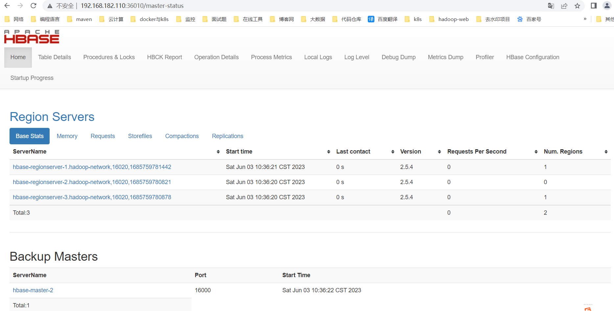

## 一、概述
`HBase` 是一个开源的 `NoSQL` **列式分布式数据库**，它主要基于 `Hadoop`  分布式文件系统（HDFS）运行。`HBase` 最初是由 `Facebook` 公司贡献，其基于 `Google`的 `Bigtable` 模型开发，在强大的水平扩展性和高可用性的基础上，提供了可以扩展垂直规模的存储。

`HBase` 主要特点如下：

- **列式存储**：`HBase` 采用列式存储的方式来存储数据，它使用 `HDFS` 作为底层文件系统，并把数据存放到 `HDFS` 中的多个 `Region` 中，每个 `Region` 能够存储多行数据。这种存储方式使得 `HBase` 可以支持非常大的数据量，并且具有更好的写性能。

- **分布式架构**：`HBase` 是一个分布式的系统，它支持将数据分散存放在多台机器上，通过水平扩展的方式来增加存储和计算能力，从而满足大规模数据存储和处理的需求。同时，它还能通过 `RegionServer` 进程的崩溃自动迁移 `Region`，实现高可用性。

- **高可靠性**：`HBase` 在存储数据时，会使用多个 `RegionServer` 来持久化数据，这样一来，即使某个 `RegionServer` 崩溃或者出现故障，不会导致所有数据都丢失或无法访问，从而保证了系统的高可靠性。

- **线性可扩展性**：`HBase` 具有非常强的线性可扩展性，可以通过添加新节点来扩展存储和计算能力，从而满足大规模数据存储和处理的需求。

总而言之，`HBase` 是一个非常适合处理非结构化、海量数据的 `NoSQL` 数据库，它具有高可用性、高可靠性、高性能等优点，能够为各类大规模数据存储和处理场景提供解决方案。


这里只是讲解容器化快速部署过程，想了解更多关于hbase的知识点可关注我以下文章：

- [列式存储的分布式数据库——HBase（环境部署）](https://mp.weixin.qq.com/s?__biz=MzI3MDM5NjgwNg==&mid=2247485271&idx=1&sn=7e6223c567e9e5417f8086d821668b0e&chksm=ead0fbbedda772a816de9b42d609df7e16ceaf3abf46566cf19a5c154e5fc52bd6a3c8474784#rd)
- [列式存储的分布式数据库——HBase Shell与SQL实战操作（HBase Master高可用实现）](https://mp.weixin.qq.com/s?__biz=MzI3MDM5NjgwNg==&mid=2247485300&idx=1&sn=a66c96fea11862048502c801c53d7d45&chksm=ead0fb9ddda7728ba9c5e18d09ad31c41f53af5e5ac68346fbb9e6031de3261890694d70a1c5#rd)
- [【云原生】HBase on k8s 编排部署讲解与实战操作](https://mp.weixin.qq.com/s?__biz=MzI3MDM5NjgwNg==&mid=2247486727&idx=1&sn=5aa8125a99b61a96c0c1c440da973f2d&chksm=ead0f1eedda778f811a681b5e94fcdda73aa24b0db4a9c1c575a17d46df8f088111e9c2a47bd#rd)

## 二、前期准备
### 1）部署 docker
```bash
# 安装yum-config-manager配置工具
yum -y install yum-utils

# 建议使用阿里云yum源：（推荐）
#yum-config-manager --add-repo https://download.docker.com/linux/centos/docker-ce.repo
yum-config-manager --add-repo http://mirrors.aliyun.com/docker-ce/linux/centos/docker-ce.repo

# 安装docker-ce版本
yum install -y docker-ce
# 启动并开机启动
systemctl enable --now docker
docker --version
```
### 2）部署 docker-compose
```bash
curl -SL https://github.com/docker/compose/releases/download/v2.16.0/docker-compose-linux-x86_64 -o /usr/local/bin/docker-compose

chmod +x /usr/local/bin/docker-compose
docker-compose --version
```
## 三、创建网络

```bash
# 创建，注意不能使用hadoop_network，要不然启动hs2服务的时候会有问题！！！
docker network create hadoop-network

# 查看
docker network ls
```
## 四、HBase 编排部署
### 1）安装 zookeeper 环境
关于 zookeeper 的快速部署可以参考我这篇文章：[【中间件】通过 docker-compose 快速部署 Zookeeper 保姆级教程](https://mp.weixin.qq.com/s?__biz=MzI3MDM5NjgwNg==&mid=2247487997&idx=1&sn=ef0dc95033f374dc8cc76aeb149e459d&chksm=ead0ed14dda76402a396a826913159826efa9e727cf8033986eec006f9b821afec07e065ca6c#rd)
### 2）安装 Hadoop 环境
关于 Hadoop 的快速部署可以参考我这篇文章：[通过 docker-compose 快速部署 Hive 详细教程](https://mp.weixin.qq.com/s?__biz=MzI3MDM5NjgwNg==&mid=2247487266&idx=1&sn=adf1e759986020d5fdde1376a24a7e0a&chksm=ead0f3cbdda77add2ebbff2007e44eb9bc357dcb54c778b2d50b3c02961a958315978dc4ae72#rd)
### 3）下载 JDK

官网下载：[https://www.oracle.com/java/technologies/downloads/](https://www.oracle.com/java/technologies/downloads/)

百度云下载

> 链接：[https://pan.baidu.com/s/1-rgW-Z-syv24vU15bmMg1w](https://pan.baidu.com/s/1-rgW-Z-syv24vU15bmMg1w)
提取码：`8888`

### 4）下载 HBase
下载地址：[http://hbase.apache.org/downloads.html](http://hbase.apache.org/downloads.html)

```bash
wget https://dlcdn.apache.org/hbase/2.5.4/hbase-2.5.4-bin.tar.gz --no-check-certificate
```
### 4）配置
- `conf/hbase-env.sh`

```bash
export JAVA_HOME=/opt/apache/jdk
export HBASE_CLASSPATH=/opt/apache/hbase/conf
export HBASE_MANAGES_ZK=false
```
- `conf/hbase-site.xml`

```xml
<configuration>
    <property>
        <name>hbase.rootdir</name>
        <value>hdfs://hadoop-hdfs-nn:9000/hbase</value>
        <!-- hdfs://ns1/hbase 对应hdfs-site.xml的dfs.nameservices属性值 -->
    </property>

    <property>
        <name>hbase.cluster.distributed</name>
        <value>true</value>
    </property>
    <property>
        <name>hbase.zookeeper.quorum</name>
        <value>zookeeper-node1,zookeeper-node2,zookeeper-node3</value>
    </property>
    <property>
        <name>hbase.zookeeper.property.clientPort</name>
        <value>2181</value>
    </property>

    <property>
        <name>hbase.master</name>
        <value>60000</value>
        <description>单机版需要配主机名/IP和端口，HA方式只需要配端口</description>
    </property>
    <property>
        <name>hbase.master.info.bindAddress</name>
        <value>0.0.0.0</value>
    </property>
    <property>
        <name>hbase.master.port</name>
        <value>16000</value>
    </property>
    <property>
        <name>hbase.master.info.port</name>
        <value>16010</value>
    </property>
    <property>
        <name>hbase.regionserver.port</name>
        <value>16020</value>
    </property>
    <property>
        <name>hbase.regionserver.info.port</name>
        <value>16030</value>
    </property>

    <property>
        <name>hbase.wal.provider</name>
        <value>filesystem</value> <!--也可以用multiwal-->
    </property>
</configuration>
```
- `conf/backup-masters`

```bash
hbase-master-2
```

- `conf/regionservers`

```bash
hbase-regionserver-1
hbase-regionserver-2
hbase-regionserver-3
```

- `conf/hadoop/core-site.xml`

```bash
<?xml version="1.0" encoding="UTF-8"?>
<?xml-stylesheet type="text/xsl" href="configuration.xsl"?>
<!--
  Licensed under the Apache License, Version 2.0 (the "License");
  you may not use this file except in compliance with the License.
  You may obtain a copy of the License at

    http://www.apache.org/licenses/LICENSE-2.0

  Unless required by applicable law or agreed to in writing, software
  distributed under the License is distributed on an "AS IS" BASIS,
  WITHOUT WARRANTIES OR CONDITIONS OF ANY KIND, either express or implied.
  See the License for the specific language governing permissions and
  limitations under the License. See accompanying LICENSE file.
-->

<!-- Put site-specific property overrides in this file. -->

<configuration>
        <!--配置namenode的地址 -->
        <property>
                <name>fs.defaultFS</name>
                <value>hdfs://hadoop-hdfs-nn:9000</value>
        </property>

        <!-- 文件的缓冲区大小(128KB),默认值是4KB -->
        <property>
                <name>io.file.buffer.size</name>
                <value>131072</value>
        </property>

        <!-- 文件系统垃圾桶保存时间 -->
        <property>
                <name>fs.trash.interval</name>
                <value>1440</value>
        </property>

        <!-- 配置hadoop临时目录，存储元数据用的，请确保该目录(/opt/apache/hadoop/data/hdfs/)已被手动创建，tmp目录会自动创建 -->
        <property>
                <name>hadoop.tmp.dir</name>
                <value>/opt/apache/hadoop/data/hdfs/tmp</value>
        </property>

        <!--配置HDFS网页登录使用的静态用户为root-->
        <property>
                <name>hadoop.http.staticuser.user</name>
                <value>root</value>
        </property>

        <!--配置root(超级用户)允许通过代理访问的主机节点-->
        <property>
                <name>hadoop.proxyuser.root.hosts</name>
                <value>*</value>
        </property>

        <!--配置root(超级用户)允许通过代理用户所属组-->
        <property>
                <name>hadoop.proxyuser.root.groups</name>
                <value>*</value>
        </property>

        <!--配置root(超级用户)允许通过代理的用户-->
        <property>
                <name>hadoop.proxyuser.root.user</name>
                <value>*</value>
        </property>

        <!--配置hive允许通过代理访问的主机节点-->
        <property>
                <name>hadoop.proxyuser.hive.hosts</name>
                <value>*</value>
        </property>

        <!--配置hive允许通过代理用户所属组-->
        <property>
                <name>hadoop.proxyuser.hive.groups</name>
                <value>*</value>
        </property>

        <!--配置hive允许通过代理访问的主机节点-->
        <property>
                <name>hadoop.proxyuser.hadoop.hosts</name>
                <value>*</value>
        </property>

        <!--配置hive允许通过代理用户所属组-->
        <property>
                <name>hadoop.proxyuser.hadoop.groups</name>
                <value>*</value>
        </property>

</configuration>
```

- `conf/hadoop/hdfs-site.xml`

```bash
<?xml version="1.0" encoding="UTF-8"?>
<?xml-stylesheet type="text/xsl" href="configuration.xsl"?>
<!--
  Licensed under the Apache License, Version 2.0 (the "License");
  you may not use this file except in compliance with the License.
  You may obtain a copy of the License at

    http://www.apache.org/licenses/LICENSE-2.0

  Unless required by applicable law or agreed to in writing, software
  distributed under the License is distributed on an "AS IS" BASIS,
  WITHOUT WARRANTIES OR CONDITIONS OF ANY KIND, either express or implied.
  See the License for the specific language governing permissions and
  limitations under the License. See accompanying LICENSE file.
-->

<!-- Put site-specific property overrides in this file. -->

<configuration>
        <!-- namenode web访问配置 -->
        <property>
                <name>dfs.namenode.http-address</name>
                <value>0.0.0.0:9870</value>
        </property>

        <!-- 必须将dfs.webhdfs.enabled属性设置为true，否则就不能使用webhdfs的LISTSTATUS、LISTFILESTATUS等需要列出文件、文件夹状态的命令，因为这些信息都是由namenode来保存的。 -->
        <property>
                <name>dfs.webhdfs.enabled</name>
                <value>true</value>
        </property>

        <property>
                <name>dfs.namenode.name.dir</name>
                <value>/opt/apache/hadoop/data/hdfs/namenode</value>
        </property>
        <property>
                <name>dfs.datanode.data.dir</name>
                <value>/opt/apache/hadoop/data/hdfs/datanode/data1,/opt/apache/hadoop/data/hdfs/datanode/data2,/opt/apache/hadoop/data/hdfs/datanode/data3</value>
        </property>

        <property>
                <name>dfs.replication</name>
                <value>3</value>
        </property>

        <!-- 设置SNN进程运行机器位置信息 -->
        <property>
                <name>dfs.namenode.secondary.http-address</name>
                <value>hadoop-hdfs-nn2:9868</value>
        </property>

        <property>
                <name>dfs.namenode.datanode.registration.ip-hostname-check</name>
                <value>false</value>
        </property>

        <!-- 白名单 -->
        <property>
                <name>dfs.hosts</name>
                <value>/opt/apache/hadoop/etc/hadoop/dfs.hosts</value>
        </property>

        <!-- 黑名单 -->
        <property>
                <name>dfs.hosts.exclude</name>
                <value>/opt/apache/hadoop/etc/hadoop/dfs.hosts.exclude</value>
        </property>

</configuration>
```
### 5）启动脚本 bootstrap.sh

```bash
#!/usr/bin/env sh


wait_for() {
        echo Waiting for $1 to listen on $2...
        while ! nc -z $1 $2; do echo waiting...; sleep 1s; done
}

start_hbase_master() {
        if [ -n "$1" -a -n "$2" ];then
                wait_for $1 $2
        fi

        ${HBASE_HOME}/bin/hbase-daemon.sh start master

        tail -f ${HBASE_HOME}/logs/*master*.out
}

start_hbase_regionserver() {

        wait_for $1 $2

        ${HBASE_HOME}/bin/hbase-daemon.sh start regionserver

        tail -f ${HBASE_HOME}/logs/*regionserver*.log
}


case $1 in
        hbase-master)
                start_hbase_master $2 $3
                ;;
        hbase-regionserver)
                start_hbase_regionserver $2 $3
                ;;
        *)
                echo "请输入正确的服务启动命令~"
        ;;
esac
```
### 6）构建镜像 Dockerfile

```bash
FROM registry.cn-hangzhou.aliyuncs.com/bigdata_cloudnative/centos:7.7.1908

RUN rm -f /etc/localtime && ln -sv /usr/share/zoneinfo/Asia/Shanghai /etc/localtime && echo "Asia/Shanghai" > /etc/timezone

RUN export LANG=zh_CN.UTF-8

# 创建用户和用户组，跟yaml编排里的user: 10000:10000
RUN groupadd --system --gid=10000 hadoop && useradd --system --home-dir /home/hadoop --uid=10000 --gid=hadoop hadoop -m

# 安装sudo
RUN yum -y install sudo ; chmod 640 /etc/sudoers

# 给hadoop添加sudo权限
RUN echo "hadoop ALL=(ALL) NOPASSWD: ALL" >> /etc/sudoers

RUN yum -y install install net-tools telnet wget nc less tree

RUN mkdir /opt/apache/

# 添加配置 JDK
ADD jdk-8u212-linux-x64.tar.gz /opt/apache/
ENV JAVA_HOME /opt/apache/jdk
ENV PATH $JAVA_HOME/bin:$PATH
RUN ln -s /opt/apache/jdk1.8.0_212 $JAVA_HOME

# HBase
ENV HBASE_VERSION 2.5.4
ADD hbase-${HBASE_VERSION}-bin.tar.gz /opt/apache/
ENV HBASE_HOME /opt/apache/hbase
ENV PATH $HBASE_HOME/bin:$PATH
RUN ln -s /opt/apache/hbase-${HBASE_VERSION} $HBASE_HOME

# copy bootstrap.sh
COPY bootstrap.sh /opt/apache/
RUN chmod +x /opt/apache/bootstrap.sh

RUN chown -R hadoop:hadoop /opt/apache

WORKDIR $HBASE_HOME
```
开始构建镜像

```bash
docker build -t registry.cn-hangzhou.aliyuncs.com/bigdata_cloudnative/hbase:2.5.4 . --no-cache

# 为了方便小伙伴下载即可使用，我这里将镜像文件推送到阿里云的镜像仓库
docker push registry.cn-hangzhou.aliyuncs.com/bigdata_cloudnative/hbase:2.5.4

### 参数解释
# -t：指定镜像名称
# . ：当前目录Dockerfile
# -f：指定Dockerfile路径
#  --no-cache：不缓存
```
### 7）编排 docker-compose.yaml

```bash
version: '3'
services:
  hbase-master-1:
    image: registry.cn-hangzhou.aliyuncs.com/bigdata_cloudnative/hbase:2.5.4
    user: "hadoop:hadoop"
    container_name: hbase-master-1
    hostname: hbase-master-1
    restart: always
    privileged: true
    env_file:
      - .env
    volumes:
      - ./conf/hbase-env.sh:${HBASE_HOME}/conf/hbase-env.sh
      - ./conf/hbase-site.xml:${HBASE_HOME}/conf/hbase-site.xml
      - ./conf/backup-masters:${HBASE_HOME}/conf/backup-masters
      - ./conf/regionservers:${HBASE_HOME}/conf/regionservers
      - ./conf/hadoop/core-site.xml:${HBASE_HOME}/conf/core-site.xml
      - ./conf/hadoop/hdfs-site.xml:${HBASE_HOME}/conf/hdfs-site.xml
    ports:
      - "36010:${HBASE_MASTER_PORT}"
    command: ["sh","-c","/opt/apache/bootstrap.sh hbase-master"]
    networks:
      - hadoop-network
    healthcheck:
      test: ["CMD-SHELL", "netstat -tnlp|grep :${HBASE_MASTER_PORT} || exit 1"]
      interval: 10s
      timeout: 20s
      retries: 3
  hbase-master-2:
    image: registry.cn-hangzhou.aliyuncs.com/bigdata_cloudnative/hbase:2.5.4
    user: "hadoop:hadoop"
    container_name: hbase-master-2
    hostname: hbase-master-2
    restart: always
    privileged: true
    env_file:
      - .env
    volumes:
      - ./conf/hbase-env.sh:${HBASE_HOME}/conf/hbase-env.sh
      - ./conf/hbase-site.xml:${HBASE_HOME}/conf/hbase-site.xml
      - ./conf/backup-masters:${HBASE_HOME}/conf/backup-masters
      - ./conf/regionservers:${HBASE_HOME}/conf/regionservers
      - ./conf/hadoop/core-site.xml:${HBASE_HOME}/conf/core-site.xml
      - ./conf/hadoop/hdfs-site.xml:${HBASE_HOME}/conf/hdfs-site.xml
    ports:
      - "36011:${HBASE_MASTER_PORT}"
    command: ["sh","-c","/opt/apache/bootstrap.sh hbase-master hbase-master-1 ${HBASE_MASTER_PORT}"]
    networks:
      - hadoop-network
    healthcheck:
      test: ["CMD-SHELL", "netstat -tnlp|grep :${HBASE_MASTER_PORT} || exit 1"]
      interval: 10s
      timeout: 20s
      retries: 3
  hbase-regionserver-1:
    image: registry.cn-hangzhou.aliyuncs.com/bigdata_cloudnative/hbase:2.5.4
    user: "hadoop:hadoop"
    container_name: hbase-regionserver-1
    hostname: hbase-regionserver-1
    restart: always
    privileged: true
    env_file:
      - .env
    volumes:
      - ./conf/hbase-env.sh:${HBASE_HOME}/conf/hbase-env.sh
      - ./conf/hbase-site.xml:${HBASE_HOME}/conf/hbase-site.xml
      - ./conf/backup-masters:${HBASE_HOME}/conf/backup-masters
      - ./conf/regionservers:${HBASE_HOME}/conf/regionservers
      - ./conf/hadoop/core-site.xml:${HBASE_HOME}/conf/core-site.xml
      - ./conf/hadoop/hdfs-site.xml:${HBASE_HOME}/conf/hdfs-site.xml
    ports:
      - "36030:${HBASE_REGIONSERVER_PORT}"
    command: ["sh","-c","/opt/apache/bootstrap.sh hbase-regionserver hbase-master-1 ${HBASE_MASTER_PORT}"]
    networks:
      - hadoop-network
    healthcheck:
      test: ["CMD-SHELL", "netstat -tnlp|grep :${HBASE_REGIONSERVER_PORT} || exit 1"]
      interval: 10s
      timeout: 10s
      retries: 3
  hbase-regionserver-2:
    image: registry.cn-hangzhou.aliyuncs.com/bigdata_cloudnative/hbase:2.5.4
    user: "hadoop:hadoop"
    container_name: hbase-regionserver-2
    hostname: hbase-regionserver-2
    restart: always
    privileged: true
    env_file:
      - .env
    volumes:
      - ./conf/hbase-env.sh:${HBASE_HOME}/conf/hbase-env.sh
      - ./conf/hbase-site.xml:${HBASE_HOME}/conf/hbase-site.xml
      - ./conf/backup-masters:${HBASE_HOME}/conf/backup-masters
      - ./conf/regionservers:${HBASE_HOME}/conf/regionservers
      - ./conf/hadoop/core-site.xml:${HBASE_HOME}/conf/core-site.xml
      - ./conf/hadoop/hdfs-site.xml:${HBASE_HOME}/conf/hdfs-site.xml
    ports:
      - "36031:${HBASE_REGIONSERVER_PORT}"
    command: ["sh","-c","/opt/apache/bootstrap.sh hbase-regionserver hbase-master-1 ${HBASE_MASTER_PORT}"]
    networks:
      - hadoop-network
    healthcheck:
      test: ["CMD-SHELL", "netstat -tnlp|grep :${HBASE_REGIONSERVER_PORT} || exit 1"]
      interval: 10s
      timeout: 10s
      retries: 3
  hbase-regionserver-3:
    image: registry.cn-hangzhou.aliyuncs.com/bigdata_cloudnative/hbase:2.5.4
    user: "hadoop:hadoop"
    container_name: hbase-regionserver-3
    hostname: hbase-regionserver-3
    restart: always
    privileged: true
    env_file:
      - .env
    volumes:
      - ./conf/hbase-env.sh:${HBASE_HOME}/conf/hbase-env.sh
      - ./conf/hbase-site.xml:${HBASE_HOME}/conf/hbase-site.xml
      - ./conf/backup-masters:${HBASE_HOME}/conf/backup-masters
      - ./conf/regionservers:${HBASE_HOME}/conf/regionservers
      - ./conf/hadoop/core-site.xml:${HBASE_HOME}/conf/core-site.xml
      - ./conf/hadoop/hdfs-site.xml:${HBASE_HOME}/conf/hdfs-site.xml
    ports:
      - "36032:${HBASE_REGIONSERVER_PORT}"
    command: ["sh","-c","/opt/apache/bootstrap.sh hbase-regionserver hbase-master-1 ${HBASE_MASTER_PORT}"]
    networks:
      - hadoop-network
    healthcheck:
      test: ["CMD-SHELL", "netstat -tnlp|grep :${HBASE_REGIONSERVER_PORT} || exit 1"]
      interval: 10s
      timeout: 10s
      retries: 3

# 连接外部网络
networks:
  hadoop-network:
    external: true
```
### 8）开始部署
```bash
docker-compose -f docker-compose.yaml up -d

# 查看
docker-compose -f docker-compose.yaml ps
```
## 五、简单测试验证
访问web：`http://ip:36010/`


```bash
docker exec -it hbase-master-1 bash

hbase shell

### 查看状态
status

### 简单的建表
create 'user', 'info', 'data'
# user是表名
# info是列族1的名字
# data 是列族2的名字

### 查看表信息
desc 'user'
```
## 六、常用的 HBase 客户端命令
HBase是一个开源的分布式列式数据库，用于在Apache Hadoop上存储和处理大规模结构化数据。你可以使用HBase的命令行界面或客户端来管理和操作HBase数据库。以下是一些常用的HBase客户端命令：

### 1）连接到HBase shell

```bash
hbase shell
```
### 2）创建表
```bash
create 'table_name', 'column_family1', 'column_family2', ...
```
### 3）查看已有表

```bash
list
```
### 4）查看表结构
```bash
describe 'table_name'
```
### 5）插入数据
```bash
put 'table_name', 'row_key', 'column_family:column', 'value'
```
### 6）获取数据

```bash
get 'table_name', 'row_key'
```
### 7）扫描表数据
```bash
scan 'table_name'
```
### 8）删除数据
```bash
delete 'table_name', 'row_key', 'column_family:column', 'timestamp'
```
### 9）禁用表
```bash
disable 'table_name'
```
### 10）启用表
```bash
enable 'table_name'
```
### 11）删除表
```bash
disable 'table_name'
drop 'table_name'
```
### 12）修改表
```bash
alter 'table_name', {NAME => 'column_family', VERSIONS => 'new_version'}
```
这些命令可以让你在HBase中创建表、插入和获取数据、扫描表数据以及对表进行管理操作。请注意，在实际使用时，你需要将命令中的'table_name'、'column_family'、'row_key'等替换为具体的表名、列族名和行键值。

--- 

到此通过 docker-compose 快速部署 HBase 保姆级教程就结束了，后续会持续更新相关技术类文章，如有疑问欢迎私信或关注公众号【大数据与云原生技术分享】加群交流或私信咨询~

